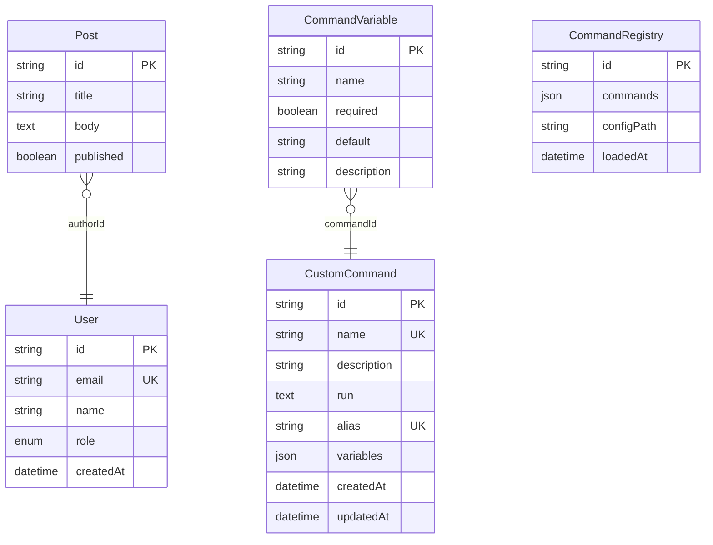

# ER Diagram

> Generated by SpecForge from my-app v0.1.0

```mermaid
erDiagram
    User {
        string id PK
        string email UK
        string name
        enum role
        datetime createdAt
    }
    Post {
        string id PK
        string title
        text body
        boolean published
    }
    CustomCommand {
        string id PK
        string name UK
        string description
        text run
        string alias UK
        json variables
        datetime createdAt
        datetime updatedAt
    }
    CommandVariable {
        string id PK
        string name
        boolean required
        string default
        string description
    }
    CommandRegistry {
        string id PK
        json commands
        string configPath
        datetime loadedAt
    }
    Post }o--|| User : "authorId"
    CommandVariable }o--|| CustomCommand : "commandId"
```
