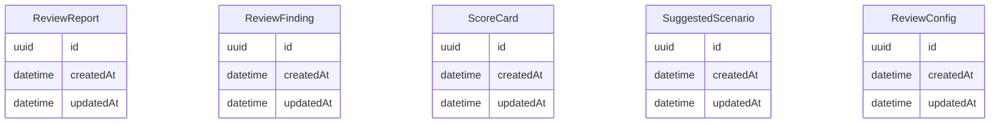

# Data Model

> Generated: 2026-02-15

## ER Diagram

## Entities

### ReviewReport

| Field | Type | Constraints |
|-------|------|-------------|
| id | uuid | PRIMARY KEY |
| createdAt | datetime | NOT NULL DEFAULT NOW() |
| updatedAt | datetime | NOT NULL DEFAULT NOW() |

### ReviewFinding

| Field | Type | Constraints |
|-------|------|-------------|
| id | uuid | PRIMARY KEY |
| createdAt | datetime | NOT NULL DEFAULT NOW() |
| updatedAt | datetime | NOT NULL DEFAULT NOW() |

### ScoreCard

| Field | Type | Constraints |
|-------|------|-------------|
| id | uuid | PRIMARY KEY |
| createdAt | datetime | NOT NULL DEFAULT NOW() |
| updatedAt | datetime | NOT NULL DEFAULT NOW() |

### SuggestedScenario

| Field | Type | Constraints |
|-------|------|-------------|
| id | uuid | PRIMARY KEY |
| createdAt | datetime | NOT NULL DEFAULT NOW() |
| updatedAt | datetime | NOT NULL DEFAULT NOW() |

### ReviewConfig

| Field | Type | Constraints |
|-------|------|-------------|
| id | uuid | PRIMARY KEY |
| createdAt | datetime | NOT NULL DEFAULT NOW() |
| updatedAt | datetime | NOT NULL DEFAULT NOW() |

