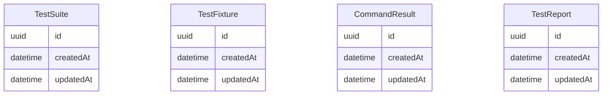

# Data Model

> Generated: 2026-02-15

## ER Diagram

## Entities

### TestSuite

| Field | Type | Constraints |
|-------|------|-------------|
| id | uuid | PRIMARY KEY |
| createdAt | datetime | NOT NULL DEFAULT NOW() |
| updatedAt | datetime | NOT NULL DEFAULT NOW() |

### TestFixture

| Field | Type | Constraints |
|-------|------|-------------|
| id | uuid | PRIMARY KEY |
| createdAt | datetime | NOT NULL DEFAULT NOW() |
| updatedAt | datetime | NOT NULL DEFAULT NOW() |

### CommandResult

| Field | Type | Constraints |
|-------|------|-------------|
| id | uuid | PRIMARY KEY |
| createdAt | datetime | NOT NULL DEFAULT NOW() |
| updatedAt | datetime | NOT NULL DEFAULT NOW() |

### TestReport

| Field | Type | Constraints |
|-------|------|-------------|
| id | uuid | PRIMARY KEY |
| createdAt | datetime | NOT NULL DEFAULT NOW() |
| updatedAt | datetime | NOT NULL DEFAULT NOW() |

